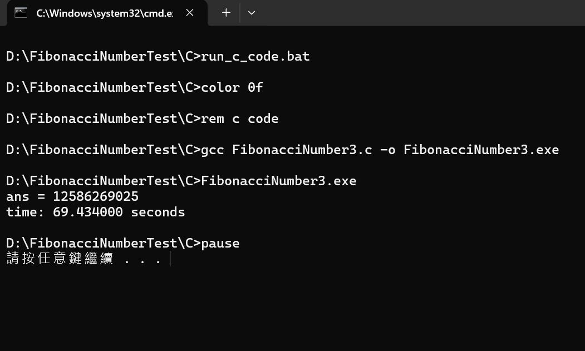
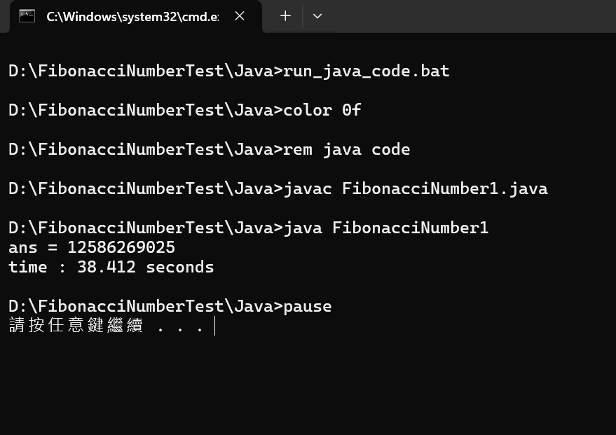

# c-java-speed

 

一個簡單的測試範例， 
測試 O(2^n) 費氏數列計算到 第50項 需耗費的時間。 
相同演算法分別以 C程式 跟 Java程式 實作， 
以此來測試不同 程式 執行速度。 
 
電腦作業系統：Windows 11 家用版 
Java編譯器 jdk版本：11.0.22 
GCC編譯器 版本：6.3.0 (x86_64-posix-seh-rev2, Built by MinGW-W64 project) 
 

C程式 69秒 

 
 

Java程式 38秒 
